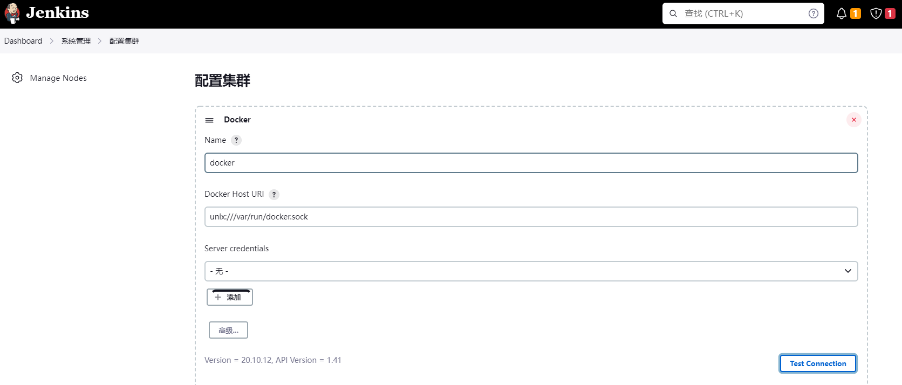
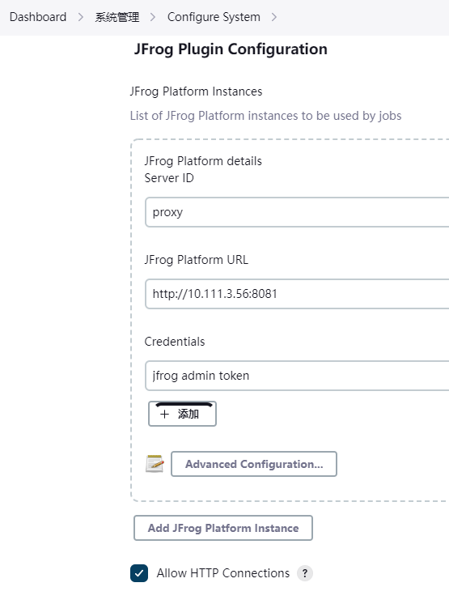
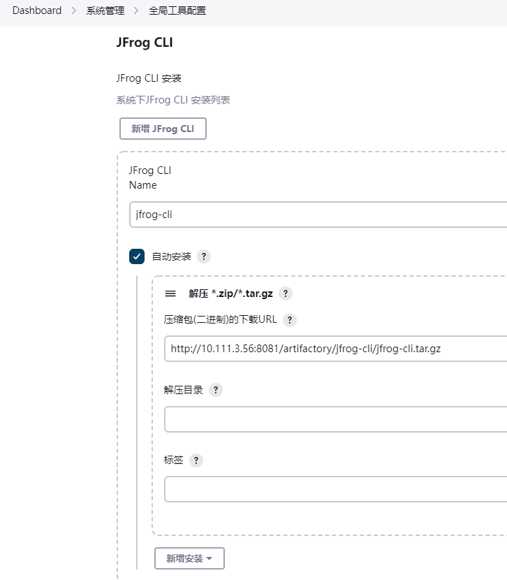
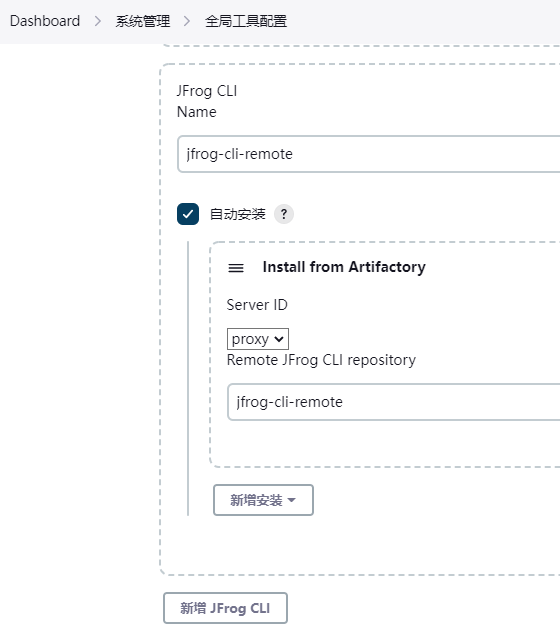
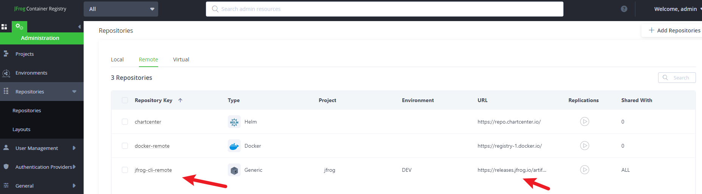
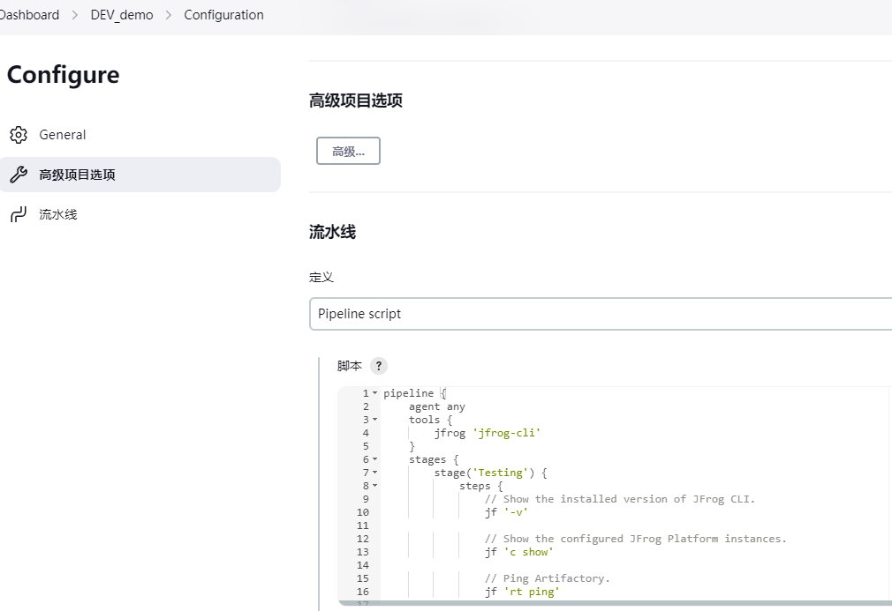

# jenkins-jfrog-demo

jenkins jfrog container registry 集成

- [x] docker maven 打包，普通文件方式上传至 Artifactory，并远程 ssh 执行命令部署
- [] docker maven 打包，docker 方式上传至 Artifactory，并远程 ssh docker-compose 部署

# 环境

- [x] Docker 20.10.12
- [x] Docker Compose v2.2.3
- [x] Jenkins 2.375.3
- [x] JFrog Container Registry license 7.55.6

# 安装

- docker ce，略
- docker-compose，略
- jenkins，使用当前目录下 `docker-compose.yml` 启动
- jfrog container registry 下载解压，运行即可，`/opt/artifactory-jcr-7.55.6/app/bin/artifactoryctl start`

# 配置

`chmod 666 /var/run/docker.sock` 使 jenkins 可以访问 docker


Jenkins 系统管理配置 JFrog 平台信息，用户密码，token 凭证应该都是支持的。


Jenkins 配置 jfrog-cli 工具，内网推荐使用直接下载解压，只是需要准备一个可以匿名下载的 URL




jfrog-cli-remote 配置的地址为：https://releases.jfrog.io/artifactory/jfrog-cli/


# 反向代理配置
不想再配置 docker 客户端支持 http，所以配置 jfrog container registry 的反向代理，使用 nginx 作为反向代理，配置如下：

```
server{
    listen 80;
    server_name reg.k8snb.com ;
    root html;
    rewrite ^(.*)$ https://$server_name$1 permanent;
}

## add ssl entries when https has been set in config
ssl_protocols TLSv1 TLSv1.1 TLSv1.2 TLSv1.3;
ssl_certificate      /opt/artifactory-jcr-7.55.6/ssl/reg.k8snb.com.pem;
ssl_certificate_key  /opt/artifactory-jcr-7.55.6/ssl/reg.k8snb.com.key;
ssl_session_cache shared:SSL:1m;
ssl_prefer_server_ciphers   on;
## server configuration
server {
    listen 443 ssl;


    server_name rep.k8snb.com;
    if ($http_x_forwarded_proto = '') {
        set $http_x_forwarded_proto  $scheme;
    }
    ## Application specific logs
    ## access_log /var/log/nginx/rep.k8snb.com-access.log timing;
    ## error_log /var/log/nginx/rep.k8snb.com-error.log;
    rewrite ^/$ /ui/ redirect;
    rewrite ^/ui$ /ui/ redirect;
    chunked_transfer_encoding on;
    client_max_body_size 0;
    location / {
    proxy_read_timeout  2400s;
    proxy_pass_header   Server;
    proxy_cookie_path   ~*^/.* /;
    proxy_buffer_size 128k;
    proxy_buffers 40 128k;
    proxy_busy_buffers_size 128k;
    proxy_pass          http://10.111.3.56:8082;
    proxy_set_header    X-JFrog-Override-Base-Url $http_x_forwarded_proto://$host:$server_port;
    proxy_set_header    X-Forwarded-Port  $server_port;
    proxy_set_header    X-Forwarded-Proto $http_x_forwarded_proto;
    proxy_set_header    Host              $http_host;
    proxy_set_header    X-Forwarded-For   $proxy_add_x_forwarded_for;
    add_header X-Content-Type-Options "nosniff" always;
    add_header Strict-Transport-Security always;

        location ~ ^/artifactory/ {
            proxy_pass    http://10.111.3.56:8081;
        }
    }
}
```

# jfrog-cli 测试

```Jenkinsfile
pipeline {
    agent any
    tools {
        jfrog 'jfrog-cli'
    }
    stages {
        stage('Testing') {
            steps {
                // Show the installed version of JFrog CLI.
                jf '-v'

                // Show the configured JFrog Platform instances.
                jf 'c show'

                // Ping Artifactory.
                jf 'rt ping'

            }
        }
    }
}
```



参考资料：  
[1] https://github.com/jfrog/jenkins-jfrog-plugin#readme  
[2] https://jfrog.com/whitepaper/best-practices-structuring-naming-artifactory-repositories/
